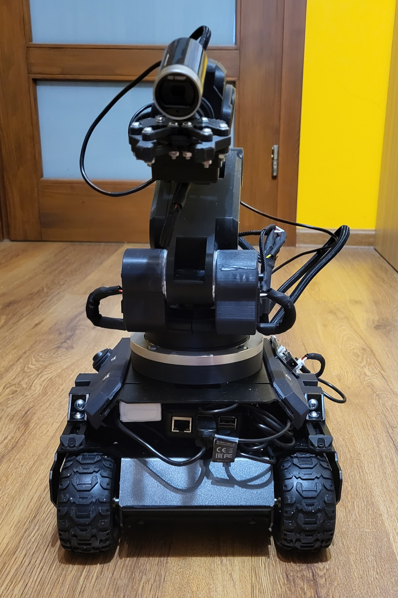
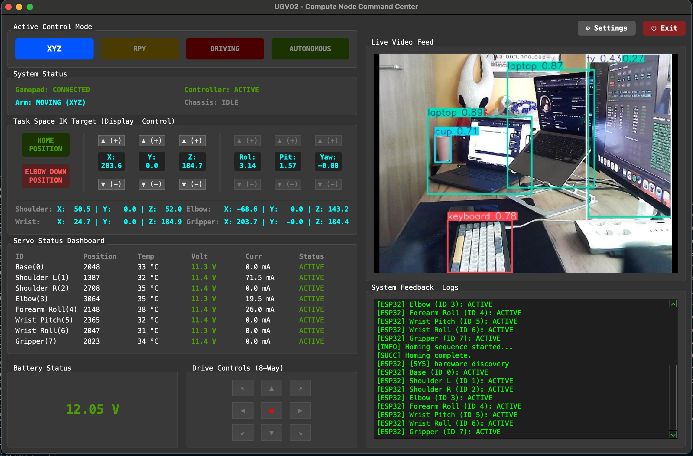
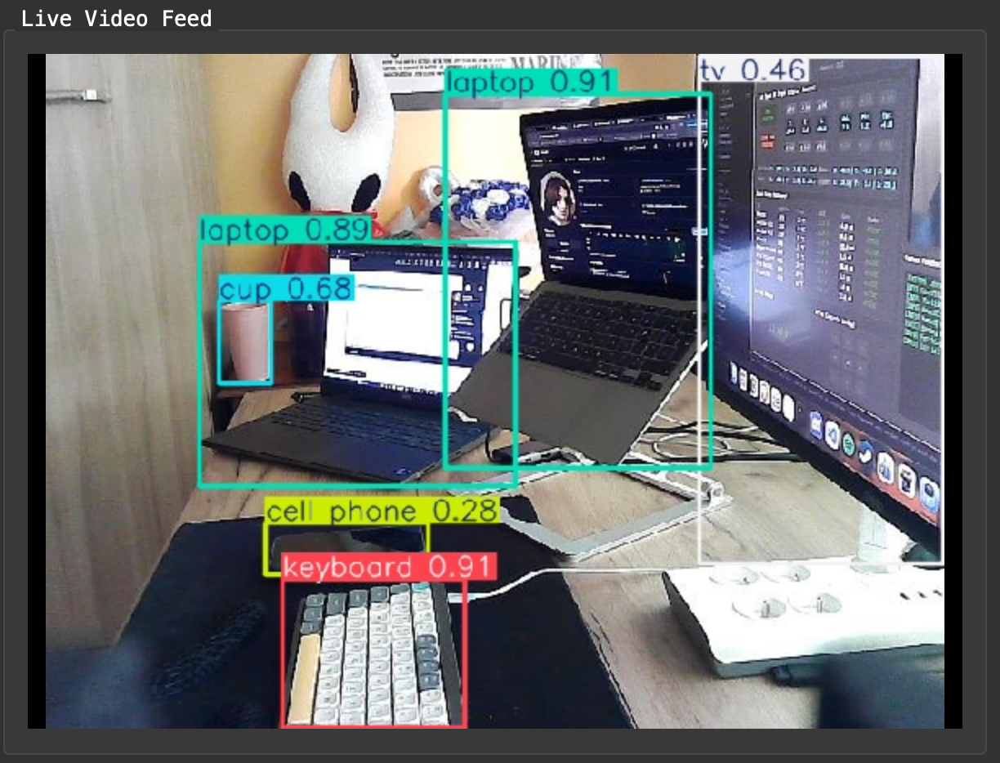
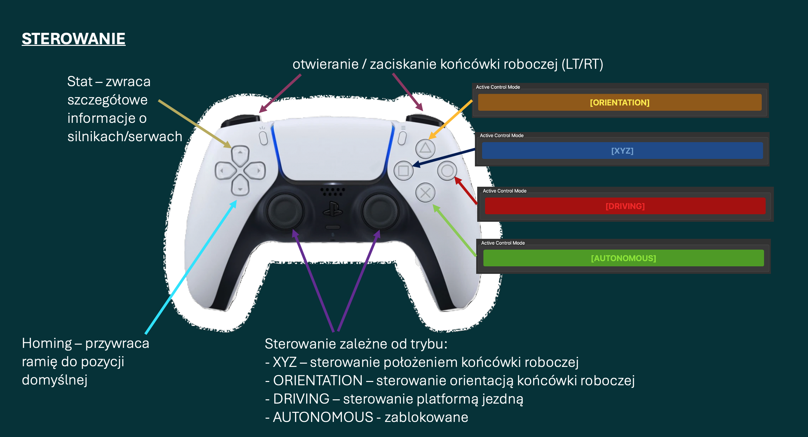

# 6-DoF Mobile Manipulator with YOLOv8 Vision & Distributed Control

[](https://www.python.org/)
[](https://zeromq.org/)
[](https://github.com/ultralytics/ultralytics)
[](https://wiki.qt.io/Qt_for_Python)

This repository contains the software and architecture overview for a custom-built, remotely controlled mobile manipulator. The project integrates a 6-DoF (Degrees of Freedom) 3D-printed robotic arm, a differential drive chassis, and an AI-powered vision module operating in real-time.

This project was created as part of an engineering thesis by **Michał Mistarz**.



## 🌟 Key Features

*   **Custom 6-DoF Robotic Arm:** Designed in CAD, 3D printed using high-temperature PolyLite ASA filament, and powered by 8 Waveshare ST3215 serial bus servos (closed-loop).
*   **Analytical Inverse Kinematics (IK):** Custom implementation of Pieper's decoupling method with Denavit-Hartenberg parameters, featuring singularity handling and smooth trajectory generation.
*   **Real-Time AI Vision:** "Eye-in-hand" camera configuration rśunning YOLOv8 Nano for real-time object detection and classification.
*   **Distributed Architecture:** Computations are split between a Controller Node (onboard Raspberry Pi) and a Compute Node (Operator PC) to save power and optimize AI inference.
*   **Low-Latency Communication:** Asynchronous Wi-Fi communication utilizing ZeroMQ (REQ/REP for controls, PUB/SUB for telemetry and video).
*   **Desktop GUI & Gamepad Control:** A fully-featured PySide6 operator station with dynamic keybinding, telemetry dashboard, and live video feed.

## 🛠️ Hardware Architecture

*   **Base:** Waveshare UGV02 (6x4 differential skid-steering platform).
*   **Main Controller Node:** Raspberry Pi 5 (8GB RAM).
*   **Servo Bridge:** ESP32-based Waveshare Servo Driver (handles low-level 1Mbps UART communication with servos).
*   **Actuators:** Waveshare ST3215 bus servos (includes a dual-motor setup on the shoulder joint for doubled torque).
*   **Vision:** A4Tech PK-910H 1080p USB Camera.
*   **Power Management:** Isolated circuits. 3S LiPo (11.1V) for the arm and electronics, and a separate high-current 18650 Li-Ion pack for the chassis motors.

## 💻 Software Architecture

The software is designed as a microservices architecture using Python and ZeroMQ to bypass the Global Interpreter Lock (GIL) and ensure fault tolerance.

### ZeroMQ Topology


1.  **Compute Node (Operator Station):** 
    Runs the PySide6 GUI, reads gamepad inputs, performs YOLOv8 inference, and displays telemetry.
2.  **Controller Node (Robot):**
    Uses a Supervisor script to manage three independent processes:
    *   `Arm Service`: Calculates Inverse Kinematics and sends joint targets to the ESP32 bridge.
    *   `Camera Service`: Captures video, compresses it to JPEG, and streams it.
    *   `Chassis Service`: Handles skid-steering logic and velocity ramping (`smooth_step`).

## 🎮 Operator Station (GUI)

The operator station is built with **PySide6** and features a dark-mode interface. It provides full control over the robot, including XYZ cartesian positioning, joint telemetry, and AI vision overlay.




### Control Modes
The system supports multiple operational modes mapped to a standard Bluetooth gamepad:
*   **XYZ Mode:** Cartesian translation of the end-effector.
*   **RPY Mode:** Orientation control (Roll, Pitch, Yaw).
*   **DRIVING Mode:** Controls the UGV02 chassis with intelligent axis inversion for reverse driving.
*   **AUTONOMOUS:** Placeholder for future ROS 2 and SLAM integration.



## 🚀 Getting Started

### Prerequisites
*   Python 3.11+
*   `requirements.txt` (includes `pyzmq`, `opencv-python`, `ultralytics`, `PySide6`, `pygame`, `numpy`)

### Running the System
1.  **On the Robot (Raspberry Pi):**
    ```bash
    python3 controller_main.py
    ```
2.  **On the Operator Station (PC):**
    ```bash
    python3 compute_node.py
    ```
    *Ensure your PC is on the same local Wi-Fi network as the robot.*

## 🔮 Future Development
*   **Custom Chassis:** Replacing the commercial UGV02 with a fully custom base for higher payload capacity and better BMS current limits.
*   **ROS 2 Migration:** Porting the control architecture to ROS 2 for native SLAM, Navigation, and point-cloud support.
*   **Numerical Path Planning:** Adding polynomial trajectory interpolation to avoid internal self-collisions during rapid singular transitions.
*   **Visual Servoing:** Automated object grasping based on YOLOv8 bounding box coordinates.

## 📝 License
This project is for educational and research purposes. Feel free to explore, fork, and modify the codebase!